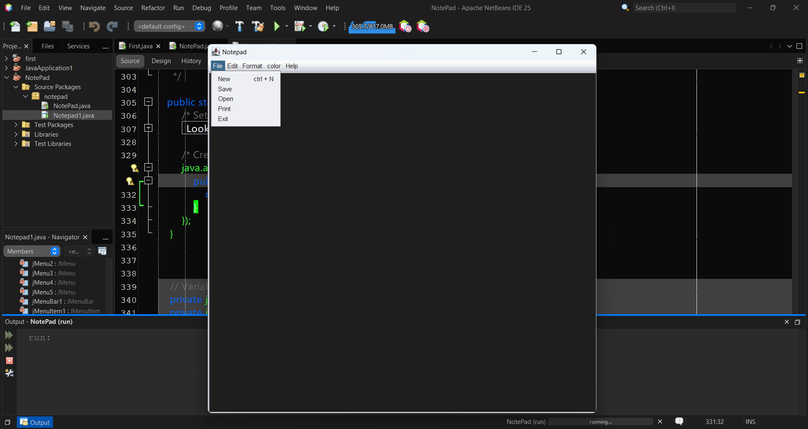

# 📝 Notepad Project

A simple **Notepad application** built with modern web technologies.  
This project provides basic text editing functionalities along with theme customization.

---

## ✨ Features
- ✅ Write and edit text  
- ✅ Undo / Redo  
- ✅ Cut / Copy / Paste  
- ✅ Select All  
- ✅ Dark Theme & Light Theme Toggle  

---

## 📸 Screenshot

---

## 🚀 Installation
1. Clone the repository:
   ```bash
   git clone https://github.com/yourusername/notepad-project.git
